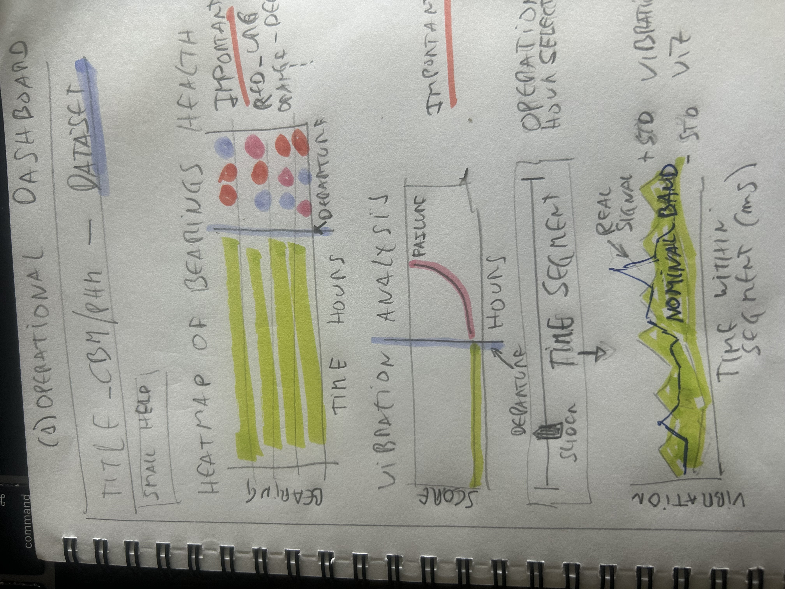
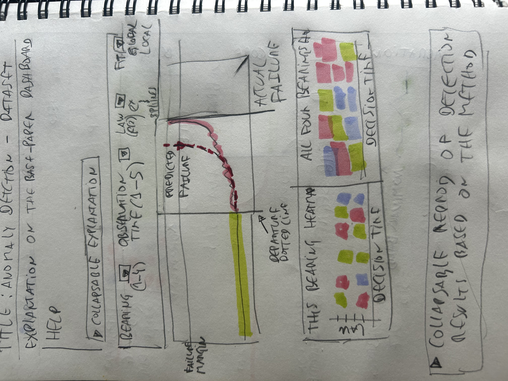
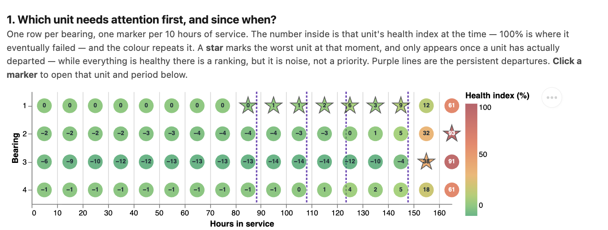
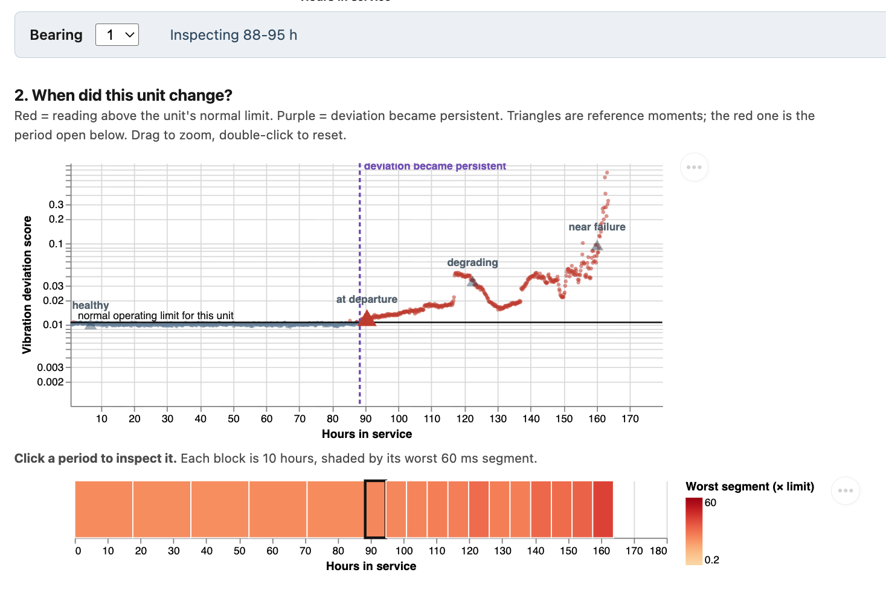
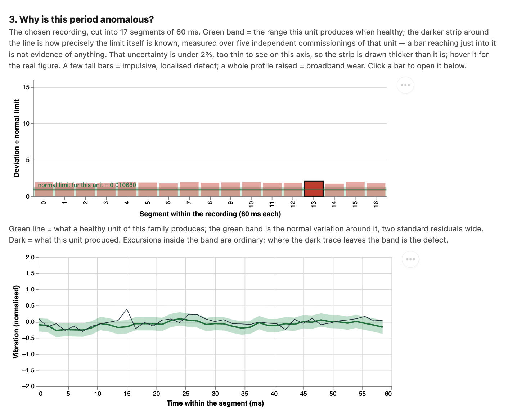
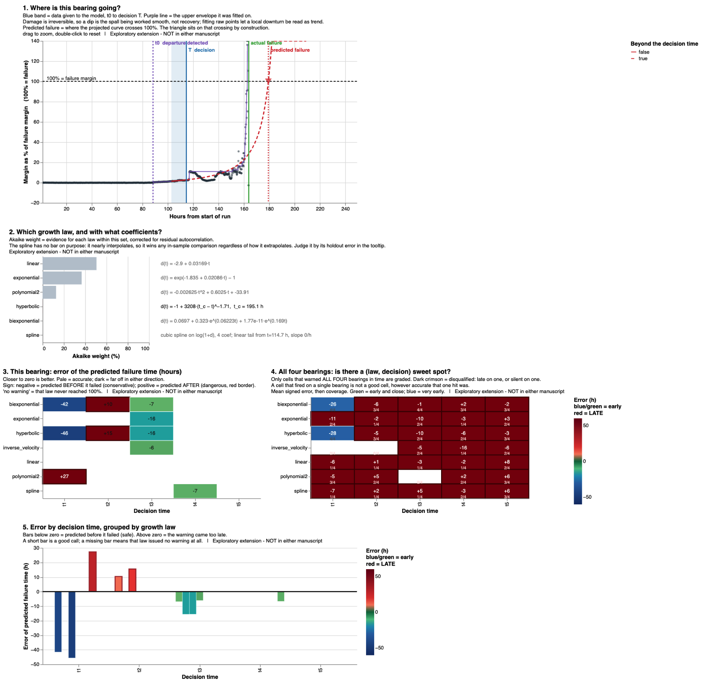

# Statement of Authorship and AI Assistance {-}

This report, including its written content, data analysis, visualization design, implementation, methodological decisions, interpretation of the results, and conclusions, is the author's own work.

Limited AI assistance (Claude by Anthropic and Grammarly) was used only for minor editorial refinement (primarily correcting typographical and grammatical errors and improving sentence conciseness) and for assisting in diagnosing a technical issue related to event propagation in nested Altair views.
\newpage

# Introduction and Problem Context

Prognostics and Health Management (PHM) aims to detect equipment degradation before a failure occurs, allowing maintenance actions to be scheduled at the most appropriate time. Instead of relying on fixed maintenance intervals, PHM uses sensor measurements to monitor the condition of physical assets and identify changes that may indicate the onset of a fault. This approach can reduce unplanned downtime, extend the useful life of components, and improve maintenance planning.

  

<strong>Figure 1.</strong> Example of a rolling bearing, the type of mechanical component analysed in this project.

To make the problem concrete: in the experiment analysed here, four
bearings were run to destruction on a single shaft. A reference model of
healthy behaviour, trained without ever observing these units, identified
every one of them between 14.5 and 74 hours before failure, and for each
alarm it can point to the fraction of a second of vibration that caused it.
The question this project addresses is not whether that detection is
possible, but whether it can be presented in a way that an engineer can
act on.

This project uses the NASA IMS Bearing Dataset (Experiment 2) [1, 2], a publicly available benchmark for predictive maintenance research. Four rolling bearings were monitored under controlled operating conditions until failure, giving a complete run-to-failure scenario suitable for studying how degradation evolves over time and how that evolution can be communicated through interactive visualisation. The illustration in Figure 1 is adapted from BKZ Industry [3].

The goal of this project is not to develop a new predictive maintenance algorithm, but to investigate how visualisation can help users understand the degradation process. The proposed interface supports three complementary tasks. First, it helps identify which bearing is beginning to deviate from its normal operating condition. Second, it provides visual evidence that explains why a particular condition has been classified as anomalous. Finally, it supports maintenance decisions by allowing users to compare degradation trends across bearings and to explore how these trends may be used to estimate the progression towards failure.

The visualisation is intended for maintenance engineers, reliability engineers, and maintenance planners who need to interpret sensor data and make informed decisions based on the observed condition of industrial assets.

# Dataset

This project uses the NASA IMS Bearing Dataset, a benchmark dataset widely used in predictive maintenance research. The experiments were conducted using a test rig equipped with four rolling bearings mounted on the same shaft and operating under constant load and speed conditions. During the experiment, vibration measurements were continuously acquired until one or more bearings reached failure.

For this project, Experiment 2 was selected because it provides a complete run-to-failure sequence with progressive degradation. The data consists of a series of vibration recordings collected at regular time intervals. Each recording contains high-frequency vibration samples that capture the dynamic behaviour of the four bearings throughout the experiment.

Rather than analysing individual recordings in isolation, the visualisation focuses on the temporal evolution of each bearing. Several signal-derived features are computed for every recording and combined into a Health Index that summarises the deviation from the nominal operating condition. This allows the visualisation to present both the detailed behaviour of individual recordings and the long-term degradation trend.

The complete dataset therefore supports multiple levels of analysis, ranging from raw vibration signals to aggregated condition indicators, enabling users to move from a fleet-level overview to detailed signal inspection.

# Goals and Tasks

The primary goal of this project is to investigate how interactive visualisation can support maintenance engineers in understanding the degradation of rolling bearings throughout a run-to-failure experiment. Rather than focusing only on anomaly detection, the visualisation aims to help users interpret the evolution of asset condition, understand the evidence supporting an alert, and prioritise maintenance decisions.

The target users are maintenance engineers, reliability engineers, and maintenance planners who regularly work with condition monitoring data but may not be experts in signal processing or machine learning. The visualisation is therefore designed to present complex information in a progressive and intuitive manner, allowing users to move from a high-level overview to detailed signal inspection.

Based on the analysis objectives defined during the previous modules of the course, the visualisation supports the following tasks.

## Task 1 – Detect degradation

Users should be able to distinguish normal operating behaviour from progressive degradation and identify which bearing first deviates from its nominal condition. The visualisation should also allow users to observe how degradation evolves over time rather than relying on isolated measurements.

## Task 2 – Explain the anomaly

Once degradation has been detected, users should understand why the system considers a particular condition anomalous. The visualisation provides multiple levels of detail, allowing users to inspect the evolution of the Health Index, examine individual recording windows, and compare anomalous vibration signals with nominal behaviour.

## Task 3 – Prioritise maintenance decisions

The visualisation should support maintenance planning by helping users
compare the condition of several bearings at once and decide which asset
needs attention first. Because all four units were run to destruction in
the same experiment, that comparison is only meaningful while there is
still time to act; the interface therefore presents priority as it evolved
over the life of the test rather than as a single verdict at the end.

A secondary and explicitly **experimental** component extends this by
projecting the observed degradation forward. It is included in order to be
tested with practitioners, not to be relied upon: the purpose is to learn
whether engineers find a projected trajectory useful at all, and what they
would need before trusting one.

# Research Questions

The visualisation presented in this project was designed to investigate the following research questions:

**RQ1.** Can an interactive visualisation help users distinguish normal bearing behaviour from progressive degradation during a run-to-failure experiment?

**RQ2.** Can users identify when persistent degradation begins and determine which bearing requires maintenance attention first?

**RQ3.** Does providing multiple levels of visual evidence—from fleet overview to raw vibration signals—help users understand why a condition is considered anomalous?

**RQ4.** Once degradation becomes persistent, do practitioners find an experimental projection of the degradation trend useful, and does the visualisation succeed in communicating how uncertain such a projection is?

*This question concerns the usefulness and the honesty of the
presentation, not the accuracy of the projection. Estimating remaining
useful life lies outside what the underlying method has been validated to
do.*

# The Underlying Method

The visualisation does not introduce a new diagnostic algorithm; it
presents the output of an existing one, developed separately by the
author. The framework — diagnosis posed as recovery of membership in a
quotient space of nuisance-invariant equivalence classes, with a
convolutional autoencoder as its computational approximation and an
adaptive per-asset threshold — is set out in a technical note deposited at
CU Scholar [4], where it is validated on synthetic signals. Its
application to the measured NASA IMS bearings, from which the figures
quoted below are taken, is reported in a manuscript in preparation [5].

This project takes that output as given and addresses its presentation.
Describing the method briefly is nevertheless necessary, because what the
interface can honestly claim is bounded by what the method has been shown
to do.

## The Health Index

Every recording is scored by a single reference model of healthy
behaviour: a convolutional autoencoder trained once on *simulated* healthy
vibration and transferred unchanged to all four bearings. No measurement
from these bearings is used to train it. The score of a recording is the
mean reconstruction error over its internal windows — how far the observed
signal is from what a sound bearing of this family would have produced.

That raw score is not comparable between units, because each bearing has
its own vibration signature. During its first hours of service each
bearing therefore establishes its own **normal operating limit**, the 98th
percentile of the reconstruction error observed while it is known to be
healthy. The four limits differ by a factor of 2.8, from 0.0067 to 0.0189,
even though the model, the target coverage and the procedure are identical
for all of them.

The **Health Index** used throughout the visualisation is the deviation of
a recording from that unit's own limit, rescaled so that 0% is the limit
itself and 100% is the level the unit had reached when the experiment
ended. Expressing condition this way is what allows four physically
different bearings to share one axis: the index answers *how far along its
own path to failure is this asset*, not *how much does it vibrate*.

## What the method achieves, and what it does not

All four bearings departed persistently from their own operating limit
before failing, with warning times of **74.0, 38.8, 14.5 and 54.3 hours**,
a mean of 45.4. Once a departure was declared, an average of 94.6% of the
remaining recordings stayed above the limit, so the alarm did not
oscillate. Calibration converged after 49 to 57 recordings, roughly eight
hours of service.

Two properties of these results shaped the design directly. The warning
times differ by a factor of five across units, so the interface has to work
both for a bearing that gives three days of notice and for one that gives
half a day. And because the limit is asset-specific, the same absolute
vibration level means different things on different units, which is why
every view is normalised to the unit's own limit rather than to an absolute
scale.

What the method has **not** been shown to do is estimate remaining useful
life. Detection is validated on these four units; projection of a failure
date is not, and Section 7.6 reports evidence that such projections are
unstable. The interface reflects that asymmetry in its structure.

---

# Visualisation Design

Both visualisations are published as static, self-contained pages and can
be opened directly:

| | |
|---|---|
| **Project site** | https://eduardodisanti.github.io/phm-bearing-visualization-blueprints/ |
| **Operational dashboard** (primary) | [open](https://eduardodisanti.github.io/phm-bearing-visualisation-blueprints/visualisation/bearing_operational.html) |
| **Prognostic exploration** (experimental) | [open](https://eduardodisanti.github.io/phm-bearing-visualisation-blueprints/visualisation/bearing_monitor.html) |
| **Source and reproduction package** | https://github.com/eduardodisanti/phm-bearing-visualisation-blueprints |

They were implemented in Altair [6], which compiles to Vega-Lite [7].
Every quantity displayed is precomputed, so the pages carry no server
component and remain usable offline.

The design follows an overview-to-detail workflow in the sense of
Shneiderman's information-seeking mantra [8]: overview first, zoom and
filter, details on demand. The interface therefore begins with the state
of the whole set of monitored bearings and reveals individual recordings
and raw signals only when the user asks for them. The two visualisations
are kept separate, with the operational dashboard as the primary artifact
and the prognostic view explicitly subordinate, for the reasons given in
Section 7.4.

## From requirements to low-fidelity prototype

The design did not begin from the data but from a short round of informal
requirements gathering with practising engineers. They were asked what they
look at when a condition-monitoring system raises an alert, what would make
them act on it, and what would make them ignore it. Three themes came back
consistently: they wanted to know **which asset** to look at first, **since
when** its behaviour had changed, and — repeatedly and emphatically —
**why** the system believed something was wrong. A verdict without evidence
was described as something they would not act on.

Those three needs became Tasks 1 to 3 and, directly, the three panels of
the dashboard. The evaluation in Section 8 returns to the same population
to check whether the interface meets the needs they described.

  

**Figure 2.** Low-fidelity prototype, sketched during the requirements
discussion. Three of its elements survived essentially unchanged: the
fleet heat map with one row per bearing and time on the horizontal axis;
the per-unit trajectory with the departure drawn as a vertical line; and
the innermost view, where the raw signal is overlaid on a nominal band of
one standard deviation so that the reader can see where the measurement
leaves it. The sketch also anticipated that the fleet view should look
uniform before the departure and only become differentiated afterwards,
which is why the final version suppresses the priority marker until a unit
has actually departed.

Two things changed during implementation. The slider used to pick an
operating hour was replaced by a strip of discrete, clickable periods: an
interval selected directly on the timeline proved an easier target than a
continuous control, and unlike a slider the strip can carry information of
its own — each block is shaded by the worst segment it contains, so
choosing where to look and seeing where the problem is became a single
action. A level was then added that the sketch did not have: a bar chart
of the seventeen segments inside the chosen recording, each expressed as a
multiple of the unit's limit. Going straight from a ten-hour period to a
single 60 ms waveform skipped the question of *which* part of the
recording was anomalous; the bars answer it before the waveform is
opened.

A third addition emerged only once the interface was in use. The sketch
moves from a fleet view to a per-unit trajectory without saying how the
unit is chosen, because on paper the reader simply looks at the row of
interest. On screen the lower panels each show one bearing at a time, so
the identity of the unit under examination is a piece of state that
persists across three views and has to be visible somewhere. An explicit
bearing selector was added for that reason, and kept in a fixed position
so the answer to "which unit am I looking at" never moves. It coexists
with selection from the fleet view — clicking a cell there sets both the
unit and the period at once — because the two serve different intentions:
one is browsing, the other is drilling down from an observation already
made.

  

**Figure 3.** Low-fidelity prototype of the second, experimental view.
Much of it reached the delivered design intact: the controls for unit,
growth law and fitting scope; the central chart with the failure margin,
the departure drawn as a dotted line and the predicted failure set against
the real one; the pair of matrices, one for the selected bearing and one
covering all four; and the reproduction of the published detection results
kept collapsed at the foot of the page, so that the method behind the view
remains available without competing with it. The "global / local" fitting
choice became the cumulative and windowed modes: the same idea, renamed
for what it does.

Three things were added or resolved afterwards. The fitted law is now
displayed **with its coefficients**, not merely named, because "this
failure is exponential" is an assertion, whereas the fitted expression and
its doubling time are quantities an engineer can check against what they
already know about the machine. A bar chart of prediction error against
decision time was also added, which the sketch did not anticipate; it
makes the cost of deciding early legible as a shape rather than as a
column of numbers.

Building those two additions exposed a problem in the sketch's own
vocabulary. It labels the control *observation time* and the matrix axis
*decision time* as though they were different quantities; they are the
same instant seen from two sides, and the terms were unified as **decision
time** throughout. It also forced an explicit decision about the sign of
the error, which the sketch left open. A projection that falls short of
the real failure is not simply "good": a large negative error means
replacing a bearing that still had days of life in it. Closer to zero is
what is wanted, and the sign says only which kind of mistake was made —
which is why the matrices encode direction as well as magnitude, and why
the recommendation prefers a combination that is never late over one that
is merely accurate on average.

---

## Operational Dashboard

The dashboard is built on the detection results described in Section 5.2,
and its structure follows from two of their properties. Because warning
times range from 14.5 to 74 hours, no fixed time window suits every unit,
so periods of inspection are defined relative to each bearing's own
departure. And because each unit has its own operating limit, every axis
that compares units is normalised to that limit rather than to raw
vibration.

The operational dashboard addresses the first three research questions by supporting detection, explanation, and prioritisation. The visualisation begins with a fleet-level overview where the condition of all monitored bearings can be compared simultaneously. From this overview, users can progressively inspect the temporal evolution of an individual bearing, identify periods of persistent degradation, and examine the recordings responsible for the observed behaviour.

Each level of the visualisation provides additional context rather than replacing the previous one. High-level indicators summarise the overall condition of the asset, while lower-level views expose the individual vibration windows and the corresponding raw signals. This progressive disclosure allows users to understand not only that an anomaly exists but also the evidence supporting the system's assessment.

**Figure 4.** Fleet view. One row per bearing, one marker per ten hours of
service, coloured by Health Index. A star marks the unit that was worst at
that moment, and appears only once a unit has actually departed: while
everything is healthy a ranking still exists, but it is noise rather than
a priority. This replaced an earlier ranking taken at the end of the test,
which reported all four units at 100% (Section 7.6).

**Figure 5.** Trajectory of the selected unit against its own operating
limit, with the point at which deviation became persistent marked. The
strip below divides the life of the bearing into inspectable periods,
shaded by the worst segment each one contains; periods are narrower after
the departure, where the failure develops quickly.

**Figure 6.** Evidence behind an alarm. The selected recording is cut into
seventeen 60 ms segments, each shown as a multiple of the unit's limit,
with the healthy range and the uncertainty of the limit itself shaded in
green. Below, the raw vibration of the worst segment is drawn against what
a healthy bearing of this family would have produced. Where the dark trace
leaves the green band is the defect.

---

## Prognostic visualisation

While the operational dashboard focuses on the current condition of the monitored assets, the second visualisation investigates how degradation evolves over time. Different trend models are compared in order to explore how early degradation observations may support an estimation of future behaviour.

The objective is not to provide an exact prediction of the failure time, but to help users understand how different assumptions influence the projected degradation trajectory. By comparing several candidate models, the visualisation also highlights the uncertainty associated with long-term extrapolation and illustrates how prediction confidence changes as additional observations become available.

**Figure 7.** Experimental prognostic view. Candidate growth laws are
fitted to the observed degradation using only the data available at a
chosen decision time, and projected forward to the level at which the unit
eventually failed. The matrix reports, for every combination of law and
decision time, how far the projected date fell from the real one, and
whether the warning would have arrived too late.

# Design Rationale

The design of the visualisation was driven by the analysis tasks rather than by the characteristics of the underlying algorithms. The primary objective was to help users understand the degradation process and support maintenance decisions while keeping the interface simple enough to be used by engineers without requiring expertise in signal processing or machine learning.

## Overview before detail

The interface follows an overview-to-detail workflow. Users first obtain a global view of the condition of all monitored bearings before progressively inspecting individual assets, specific recordings, and finally the raw vibration signals.

This approach allows maintenance decisions to be made efficiently while preserving access to the evidence supporting each observation. Instead of exposing all available information simultaneously, additional detail is revealed only when required.

## Progressive disclosure

The visualisation is organised into several levels of abstraction.

- Fleet overview
- Individual bearing evolution
- Recording inspection
- Signal window analysis
- Raw vibration comparison

Each level answers a different question while maintaining the context provided by the previous one. This organisation reduces visual clutter and helps users focus on the information that is relevant to their current task.

## Supporting explanation rather than automation

One of the main goals of the interface is not simply to indicate that an anomaly exists, but to help users understand why.

For this reason, the visualisation exposes the evidence used during the analysis instead of presenting only a binary decision. Users can compare healthy and degraded behaviour, inspect the temporal evolution of the Health Index, and analyse the vibration signals associated with each recording.

This design encourages users to validate the system's conclusions rather than treating the output as a black-box prediction.

## Separation between operational monitoring and prognosis

The two views are delivered as separate pages, and the honest account of
why begins with a constraint rather than with a principle.

Both were originally built as one page. Every quantity displayed is
precomputed and embedded so that the result is self-contained and needs no
server, which is a deliberate property: it survives being emailed, opened
offline, or served from a static host. The cost is weight. Together the
two views exceeded fourteen megabytes, and the browser stalled while
parsing the specification — the page rendered eventually, or froze, depending on the machine. Splitting them was forced by that, not chosen.

A conceptual justification was available afterwards, and it is a real one:
current condition and future trajectory are different engineering
questions carrying very different levels of uncertainty, and keeping them
apart helps a reader distinguish observed evidence from model-based
projection. It also protected the evaluation, since a participant asked to
assess a maintenance dashboard should not have a model-comparison view
open beside it. But the ordering matters and is reported here as it
happened: the constraint came first and the argument was constructed to
fit it. Presenting the second as though it had been the first would be a
rationalisation, and the evaluation in Section 8 immediately exposed its
limits — two of the three participants asked for the projection to be
brought back into the operational dashboard.

The resolution proposed in Section 10 accepts that criticism without
abandoning the distinction: a bounded time-to-failure band belongs in the
operational view, where the decision is made, while the comparison of
candidate laws stays in the secondary one, where the method is examined.

## Simplicity and consistency

The visualisations use consistent visual encodings throughout the interface. Bearings preserve the same identity across all views, temporal information is displayed using the same chronological order, and related information is grouped together to minimise unnecessary cognitive effort.

Where possible, interactions replace additional graphics. Users reveal information by selecting bearings and recordings instead of navigating multiple independent plots, allowing the interface to remain compact while still supporting detailed inspection.

## What building the visualisation revealed

Several findings emerged during implementation that were not visible from
the design alone. Each one changed the interface.

**A ranking taken at the end of the test carries no information.** The
first version of the fleet panel ranked the four bearings by Health Index
at the last available reading. All four came out at 100%, which is correct
and useless: by then every unit had been run to destruction. The question a
planner asks is not who is worst now but who was worst *while there was
still time to act*, and answering it meant replacing the ranking with a
timeline of each unit's condition across the experiment. Priority is only
meaningful once at least one unit has departed, so the marker identifying
the worst unit is suppressed before that point rather than ranking four
healthy assets against one another.

**The presentation layer has its own failure modes, and they can be
dangerous.** Fleet status was initially computed from each bearing's last
recording. The dataset contains occasional dropped acquisitions, and when a
unit's final reading happened to be one of them the dashboard reported it
as **Nominal at the moment it was destroyed**. The detector was working
correctly; the fault lay entirely in the summary statistic chosen to
display it, and it failed in the reassuring direction. Robust statistics
were adopted as a result: the median of the last several readings, and an
explicit filter for post-departure readings falling below half the unit's
minimum commissioning score.

**Fixed scales are what make degradation visible.** With axes autoscaled
per view, a harmless recording and a destroyed one were drawn at identical
heights, and the growth that is the entire point of a run-to-failure
experiment disappeared. Every comparable axis in the final dashboard has a
fixed domain computed once across the whole dataset. This costs resolution
on quiet periods and was judged worth it.

**Projected failure dates are sensitive to model specification.** The
experimental prognostic view initially suggested that one growth law — a
power law with a finite-time singularity — was systematically
conservative, never predicting failure later than it occurred on any of
the four bearings. Adding a single baseline parameter to that same model,
a change made for unrelated reasons, removed the property entirely: the
same family then predicted late at three of the five decision times. A
behaviour that disappears under a minor reparameterisation is an artefact
of the parameterisation, not a property of the failure process. This is
the central reason the prognostic view is presented as experimental, and
it is reported here rather than omitted.

**Tooling constrained the interaction design.** The declarative
visualisation grammar used here lifts interaction parameters to the top of
a concatenated specification, where a click selection has no marks bound to
it: the chart renders correctly and simply does not respond, with no error
raised anywhere. The dashboard was restructured into five independently
embedded specifications coordinated by explicit signals. The general
lesson is that interaction failures of this kind are silent, which makes
them expensive to find and argues for testing interaction on the deployed
artefact rather than in the authoring environment.

# Evaluation

The visualisation was evaluated through a small task-based usability study designed to assess whether users could successfully interpret bearing degradation and complete the analysis tasks defined in Section 3.

The evaluation involved three railway professionals with different engineering backgrounds:

- One railway mechanical engineer responsible for the design of point (switch) machines at an Alstom engineering centre in Katowice, Poland.
- Two maintenance engineers from the Alstom maintenance facility in Florence, Italy, both with experience in the operation and maintenance of railway assets.

Although none of the participants work specifically with bearing diagnostics, all of them routinely analyse the condition of railway equipment and make maintenance-related decisions. Their feedback therefore provides a realistic assessment of whether the visualisation communicates degradation information in a way that is understandable and useful for engineering practice.

## Evaluation Procedure

Participants received a brief introduction describing the purpose of the visualisation together with a short explanation of the NASA IMS bearing experiment. No explanation of the underlying algorithms or Health Index computation was provided in advance, allowing the interface to be evaluated independently of its implementation.

Each participant was then asked to interact freely with the visualisation while completing a series of representative maintenance tasks.

The proposed tasks included:

- Identify which bearing first shows persistent degradation.
- Estimate approximately when degradation begins.
- Explain why the selected bearing is considered anomalous.
- Identify the visual evidence supporting that conclusion.
- Decide which bearing should be prioritised for maintenance.
- Explore the degradation trends and discuss whether the future evolution appears predictable.

Participants were encouraged to think aloud during the evaluation and to explain the reasoning behind each decision.

---

## Evaluation measures

The plan proposed in an earlier module included quantitative measures of
diagnostic and detection accuracy. These were narrowed for the final study:
with three participants and a single dataset, accuracy rates would not be
interpretable, and the more informative question is whether the interface
communicates what it intends to. The measures retained are behavioural and
qualitative.

For each task the following were recorded:

- whether the participant reached the correct conclusion, and unaided;
- what visual evidence they cited when explaining that conclusion;
- how long the task took, as an indication of effort rather than a score;
- their stated confidence, and what would raise or lower it;
- any point at which they misread an encoding or asked what something
  meant.

Participants were also asked, at the end, whether the interface would
change what they did on a normal working day — the question that separates
an interesting visualisation from a useful one.

---

## Results

### PARTICIPANT 1 — mechanical engineer, point (switch) machines, Katowice.

- Task 1, identify the degrading bearing: outcome, time, unaided?
> **Outcome** Useful, I was able to clearly identify the stable departure for the four bearings, found also understand that the degradation changes law towards failure. This is an important **insight** to communicate to the field maintainers that the failure, at some point, may happen very fast. Was a clear intuition before, but now, the model and the dashbord gives us a tool to investigate and also a tangible proof.
The zoom capabilities and the click on the explorer below the trajectory help to have everything  
**Time** Easy to understand, also useful text under de visual elements. After a couple of minutes I was navigating the dashboard by myself.  **Unaided** Not completely, had to explain the zoom and collapsible elements.

- Task 2, when degradation began: 
> **Clear** The blue dashed line marking the departure and the triangles marking the procees plus the visual curve of this *degradation score*, are extremely clear.

- Task 3, why it is anomalous: 
> **Very useful** One of the best figures. Suggestion: add also zoom there and mark the points with a dot to better understand the transitions.

- Task 4, prioritisation: did they use the timeline, or default to the
  latest reading?
> **Both** Both ways of working are important to measure the vibration not only on the bearing but the rest of the asset. At some point the vibration is so big that the harmonics may break something else, or the bearing may be reacting to another harmonic.

- Task 5, experimental projection:  useful, distrusted, ignored?
> **Useful**: Needs more work but the ability of the dashboard to switch different functions and splines gives them some tools to diagnose. They request to be able to change the coefficients of the functions through the interface and see the projections.
Also, they found the estimations quite good but still unstable.

- Confidence and comments: 
> **Trust**: Good, results matches field experience and can help the work in the lab and potentially in the field.
**Comment**: "Looking forward to testing on our machines."

###  PARTICIPANT 2 — maintenance engineer, Florence
 - Task 1, identify the degrading bearing: outcome, time, unaided?
> **Outcome** Useful, prioritisation of the failing bearing plus the shape of the trajectory along with the zoom and the click per segment, that shows the actual vibration pattern makes this tool useful for the field provided they can use into a tablet.
The projection is fine, but I prefer a timeframe, best - worst case, I'll use while this timeframe is ready. 
> **Time** Immediately, the operational dashboard is very intuitive for maintainers.  
> **Unaided** Yes, he opened it, read it by himself and used it at once.

- Task 2, when degradation began: 
> **Clear** Very clear. Including when the vibration score starts to grow faster. Is when they should act.

- Task 3, why it is anomalous: 
> **Very useful** Best figure, this allows me to understand if is a transitory condition like extreme cold or heat, a broken bogie (a train component that can vibrate) or a real problem.

- Task 4, prioritisation: did they use the timeline, or default to the
  latest reading?
> **Both** Trains out there are not perfect, seen the nominal vibration plus the slider one (when start to go critical) helps us to understand if we need a planned or tactical intervention.

- Task 5, experimental projection:  useful, distrusted, ignored?
> **Useful**: The projection is not allways stable, which is normal but is very useful, keep working on that. In the meantime, its ok to have different degrading laws.

- Confidence and comments: 
> **Trust**: Looks good, just make sure this will work in the field with local data.
**Comment**: "When this works I'll buy you a beer"

### PARTICIPANT 3 — Maintenance engineer, Florence
 - Task 1, identify the degrading bearing: outcome, time, unaided?
> **Outcome** Useful, knowing when the departure starts and when the trajectory starts to uncontrollably grow is what we need to understand when to change the bearing. 
> **Time** Very fast, had to explain that there are two dashboards, one for the operational data and one for the estimation and experiments.  
> **Unaided** Yes, but he wants the projection in the same dashboard.

- Task 2, when degradation began: 
> **Clear** Very clear. Now we know when the departure won't come back.

- Task 3, why it is anomalous: 
> **Very useful** Its easy to understand even which part of the bearing may be failing.

- Task 4, prioritisation: did they use the timeline, or default to the
  latest reading?
> **Both** In the field there are lots of transient conditions and need to be assesed separately.

- Task 5, experimental projection:  useful, distrusted, ignored?
> **Useful**: Very good! Do you have any confidence metric on that? (Answer, not yet, I'm just testing the method)

- Confidence and comments: 
> **Trust**: I need metrics but looks credible, the prediciton is still unstable but is expected on bearings.

### Observations across participants

All three completed the tasks and described the dashboard as useful. Two
of the three navigated it without assistance from the outset; the third
needed the zoom and the collapsible sections pointed out before he could
work alone. The explanatory text under each panel, which had been a
concern because of the vertical space it consumes, was mentioned
positively by all three: none asked for it to be removed.

Three findings recur across the sessions and matter more than the general
approval.

**The evidence panel was the most valued view, and it is used for
something the design did not anticipate.** All three named it their best
figure. It was built to justify an alarm, i.e. to show which fraction of a
second caused it, but Participant 2 described using it to *rule causes
out*: to decide whether what he is seeing is "a transitory condition like
extreme cold or heat, a broken bogie, or a real problem". Participant 3
said it lets him infer which part of the bearing may be failing. The panel
therefore supports differential diagnosis, not merely confirmation, which
is a stronger claim than the one it was designed for.

**The visualisation made tacit knowledge demonstrable.** Participant 1
observed that the change of degradation law approaching failure "was a
clear intuition before, but now the model and the dashboard give us a tool
to investigate and also a tangible proof", and framed this as something to
communicate to field maintainers: that beyond a certain point failure can
develop very quickly. The value reported was not that the tool detects
something they did not know, but that it makes something they already
believed defensible to others.

**Everyone flagged the instability of the projection, and everyone
considered it expected.** All three called the projection useful and all
three qualified it. Participant 2: "not always stable, which is normal but
very useful, keep working on that." Participant 3 asked directly whether
any confidence metric accompanies it. That question is treated as a
result rather than as a request, and is discussed below.

### Where the interface failed

The sessions produced four specific failures. They are recorded because a
usability evaluation reporting none has usually not looked hard enough.

**Two interactions were not discoverable.** Participant 1 could not
proceed unaided: the zoom on the trajectory and the collapsible sections
had to be explained. Both are conventional interactions, and neither is
labelled in the interface beyond a line of subtitle text -> evidently not
enough.

**The structure of the site was not self-evident.** Participant 3 had to
be told that there are two dashboards. A reader arriving at the
operational view has no indication that a second one exists until they
navigate back, and the landing page carries that burden alone.

**The separation of the two views was rejected by the users it was meant
to serve.** Participant 3 asked for the projection inside the operational
dashboard. Participant 2 said he would prefer "a timeframe, best–worst
case" and would use the projection in the meantime. The argument set out
in Section 7.4 for keeping them apart does not persuade the audience it
concerns, and the honest reading is that the constraint that produced the
split was reframed as a virtue.

**Uncertainty was not communicated successfully.** This is the most
important failure, because it is RQ4. The prognostic view already carries
bootstrap prediction bands that widen with extrapolation distance, a
holdout error for every fit, and a matrix encoding whether a warning would
have arrived late. Participant 3 nevertheless asked whether there was any
confidence metric. Uncertainty was displayed and was not received: shown,
but not read as an answer to the question the engineer was actually
asking, which is *how much should I trust this date*. **Presenting
uncertainty** and **communicating it** are evidently not the same thing.

A fifth, smaller point: Participant 1 asked for the same zoom to be
available on the evidence panel and for individual points to be marked so
transitions can be followed, an encoding gap rather than a conceptual one.
Participant 2 added a deployment requirement that had not been considered
at all: the interface must work on a tablet, since that is what is
carried into the field.

### What the participants asked for

Converging across the three sessions, the single most requested addition
is a bounded estimate of time to failure inside the operational view:
best and worst case rather than a point estimate, drawn from the two laws
the data most often support. This is both the clearest result of the
evaluation and, conveniently, straightforward to implement, since the
fitted trajectories and their bootstrap bounds are already computed.

Participants 1 and 3 also asked for control over the projection by 
adjusting coefficients directly in the interface and seeing the trajectory
respond, which suggests they want to interrogate the model rather than
receive its output, consistent with the design principle of Section 7.3.

---

# Discussion

The visualisation was designed to support maintenance decisions by combining high-level condition monitoring with detailed signal inspection. Rather than replacing engineering judgement, the interface aims to provide the evidence required for users to understand how degradation evolves and why a particular bearing should receive attention.

One of the main strengths of the proposed design is the progressive transition from overview to detail. Users can quickly identify the bearing requiring attention and then progressively inspect the Health Index evolution, individual recordings, and raw vibration signals without losing context. This organisation helps transform a large collection of time-series measurements into an interpretable decision-making process.

Separating operational monitoring from prognostic exploration is harder to
defend than it appeared before the evaluation. The distinction is real —
current condition and future trajectory carry different levels of
uncertainty — but the split was originally forced by page weight, and two
of the three participants asked for it to be undone. The conclusion drawn
here is that the distinction should be preserved in what is *claimed*
rather than in what is *separated*: a bounded projection can sit in the
operational view, provided it is visibly bounded, while the comparison of
candidate laws remains elsewhere.

The prognostic visualisation also highlights an important practical limitation. While degradation trends often appear smooth during the early stages of deterioration, predictions become increasingly uncertain as the system approaches failure. Different mathematical models may produce similar short-term estimates while diverging significantly over longer prediction horizons. For this reason, the visualisation presents prognosis as an exploratory aid rather than as an exact prediction of failure time.

The evaluation reported here concerns the usability of the visualisation,
not the validity of a prognostic model, and the two should not be
conflated. Detection is supported by evidence: a shared representation,
trained without access to these bearings, flagged all four between 14.5 and
74 hours before failure. Projection is not: it rests on four failures, and
the projected dates were shown to move under minor changes to the model
specification. The interface is designed to keep those two claims visually
and structurally separate, and whether it succeeds in doing so is itself
one of the things this evaluation set out to test.

# Conclusions and Future Work

This project explored how interactive visualisation can support the analysis of bearing degradation using the NASA IMS run-to-failure dataset. Rather than focusing solely on anomaly detection, the proposed interface was designed to help users detect degradation, understand the evidence supporting an anomaly, and prioritise maintenance decisions through an overview-to-detail workflow.

The resulting visualisation combines high-level condition monitoring with detailed signal inspection, allowing users to progressively investigate the behaviour of individual bearings while preserving the context of the overall experiment. A complementary prognostic visualisation was also developed to explore how degradation trends may support an estimation of future behaviour and to illustrate the uncertainty associated with long-term projections.

Overall, the project demonstrates that interactive visualisation can play an important role in predictive maintenance by improving the interpretability of condition monitoring data and supporting engineering decision-making. Instead of presenting only numerical indicators or automated classifications, the visualisation encourages users to inspect the available evidence and build confidence in their conclusions.

The evaluation points to four changes, in order of what the participants
asked for. A bounded time-to-failure band — best and worst case, drawn
from the two laws the data most often support — should be brought into the
operational view, since all three participants converged on wanting it
there. Uncertainty needs to be communicated differently rather than more:
the bands and holdout errors already exist and a participant still asked
whether any confidence metric was available, so the failure is one of
framing, not of computation. The two interactions that had to be explained,
zoom and the collapsible sections, need to announce themselves. And the
interface has to work on a tablet, which is what is carried into the field
and was not a consideration during design.

Beyond that, the visualisation could be extended to further datasets and
validated with a larger group of users. The projection in particular
rests on four failures, and no amount of interface work will change what
that sample can support.

Although developed as part of an information visualisation course, the resulting prototype illustrates how interactive visual analytics can bridge the gap between machine learning outputs and engineering decision-making, making predictive maintenance systems more transparent and easier to interpret.

# References

1. Qiu, H., Lee, J., Lin, J., Yu, G. *Wavelet filter-based weak signature
   detection method and its application on rolling element bearing
   prognostics.* Journal of Sound and Vibration, 289(4–5), 1066–1090, 2006.

2. NASA Open Data Portal. *IMS Bearings Dataset.*
   https://data.nasa.gov/dataset/ims-bearings

3. BKZ Industry. *What is an IMS Bearing?*
   https://bkzindustry.com/what-is-an-ims-bearing-explained-in-detail

4. Di Santi, E. *Anomaly Detection as an Inverse Problem on Quotient
   Spaces: Equivalence Relations and Functional Manifolds as a General
   Diagnostic Framework.* Technical Note, University of Colorado Boulder, June 2026.
   https://scholar.colorado.edu/concern/reports/7h149s02s

5. Di Santi, E. *Anomaly Detection and Classification as an Inverse Problem
   over a Quotient Space of Nuisance-Invariant Functional Manifolds: Theory
   and Validation on Synthetic, CWRU, and NASA IMS Bearing Data.*
   Manuscript in preparation, 2026.

6. VanderPlas, J. et al. *Altair: Interactive Statistical Visualizations for
   Python.* Journal of Open Source Software, 3(32), 1057, 2018.

7. Satyanarayan, A., Moritz, D., Wongsuphasawat, K., Heer, J.
   *Vega-Lite: A Grammar of Interactive Graphics.* IEEE Transactions on
   Visualization and Computer Graphics, 23(1), 341–350, 2017.

8. Shneiderman, B. *The Eyes Have It: A Task by Data Type Taxonomy for
   Information Visualizations.* IEEE Symposium on Visual Languages, 1996.

9. Munzner, T. *Visualization Analysis and Design.* CRC Press, 2014.

---
